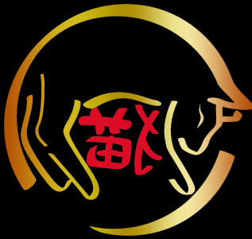

# Nyaakuza-Bot V1.0.0, Created By Reflux Software Developments And Developed By McZarya

A Moderation Bot For The Nyaakuza.

# Change Log
Change Log
Nyaakuza Bot Version 1.0.0

Added Change Log (No Shit)
Added Mute and Unmute feature
Added 'avatar' command witch posts a specified users profile picture
Fixed some minor errors
Sanity Lost
2
# Install Instructions

1: Open config.json in your code editor and enter the token, prefix and client id in each of the quotation marks
Once you have that done, save the file.

2: open your command prompt (cmd.exe) and type "npm install discord.js nodemon --save" without the qoutes 

3: Once it has finished installing all the dependencies, you can run start.bat.

## Note: This bot is not finished and may have problems or not work at all
Reflux Software Developments or its employees not responsible for anything you do with this bot.
