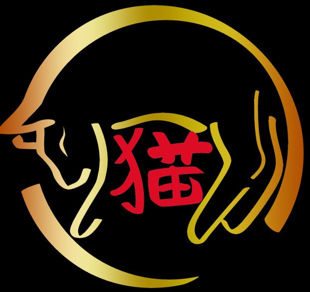

# Nyaakuza-Bot V1.0.0, Created By Reflux Software Developments And Developed By McZarya

A Moderation Bot For The Nyaakuza.

Install Instructions

1: Open bot.js in your code editor and edit the client.login(The Bot Token) at the bottom of the page.

Once you have that done, save the file.

2: open your command prompt (cmd.exe) and type "npm install discord.js nodemon --save" without the qoutes 

3: Once it has finished installing all the dependencies, you can run start.bat.

Reflux Software Developments or its employees not responsible for anything you do with this bot.
